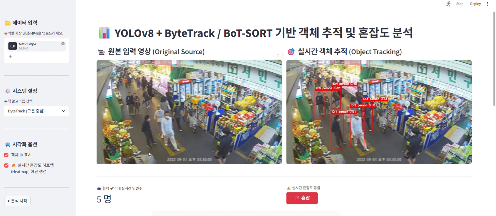

# 🚀 CrowdPaulse
> **YOLOv8** 탐지 모델과 **ByteTrack / BoT-SORT** 알고리즘을 결합하여 전통시장 내 유동 인구를 실시간으로 모니터링하고 히트맵을 통해 공간 혼잡도를 시각화하는 Streamlit 대시보드 시스템입니다.

#1.프로젝트 소개 및 실행 화면
전통시장 및 대형시장과 같은 긴 통로형 공간은 구역마다 배경이 다르고, 사람 밀집도와 이동패턴이 달라진다는 특징이 있다. 그래서 기존의 단순 객체 탐지를 넘어 다양한 CCTV 환경에서도 객체를 안정적으로 추적하는 것을 목표로 프로젝트를 설계했다.

## 실행화면
![실행 결과]

## 주요 기능
* **실시간 객체 탐지 및 추적**: YOLOv8 기반의 정밀한 탐지와 ByteTrack/BoT-SORT를 통한 객체 추적
* **밀집도 분석**: 인원수에 따라 여유/보통/혼잡으로 나눈 컬러맵 기능 제공
* **실시간 히트맵 생성**: 사람들의 밀집도를 기반으로 하여 동적 히트맵 생성
* **streamlit 기반 UI**: 사용자 친화적인 웸 인터페이스 제공

## 개발환경
**Language**: Python 3.13.7
**Core**: `ultralytics`, `opencv-python`, `numpy`, `streamlit`

## 설치 및 실행 방법

### 1. 레포지토리 복제
```bash
git clone https://github.com/seokyeonyy/cvproject_crowd.git
cd cvproject_crowd
```

### 2. 가상환경 설정 및 라이브러리 설치
# 가상환경 생성
python -m venv venv
# 가상환경 활성화
venv\Scripts\activate
# 의존성 패키지 설치
pip install -r requirements.txt

### 3. 가중치 파일 
GitHub 용량 제한으로 인해 모델 가중치는 별도로 제공합니다.
* **다운로드 링크**: [https://drive.google.com/file/d/1DtZd0fJXHqrBgn-ZcnmdVTmVFpBe74-s/view?usp=sharing]
* **설치 방법**: 위 링크에서 다운로드한 'best.pt' 파일을 프로젝트 루트의 'weights/' 폴더 내에 배치하세요. 

### 4. 애플리케이션 실행
streamlit run app.py

### 데이터 파이프라인 
1. 데이터 입력: 카메라/영상 프레임 캡처 및 정규화
2. 객체 탐지 및 추적: YOLOv8 탐지 밑 ByteTrack/BoT-SORT ID 추적
3. 히트맵 연산: 중심점 좌표 기반 원형 마스크 생성 및 가우시안 블러 적용
4. 가중치 누적: 프레임별 히트맵 강도 누적을 통한 밀집도 표현
5. 시각화 및 합성: 알파 블렌딩을 통한 원본 영상과 히트맵의 실시간 합성 출력

### 팀원별 역할 분담
| 이름 | 역할 | 

| 이정민 | 데이터셋(train) 라벨링 | YOLO 모델 최적화, BoT-SORT 모델 최적화 | 모델 성능 평가 | 오분류/탐지 실패 분석 | 다양한 영상 환경에서의 성능 테스트, 예외 케이스 처리 로직 검증 | 보고서 작성 | ppt 작성 |

| 홍석연 | 데이터셋(valid)라벨링 | ByteTrack 모델 최적화 | 모델 성능 평가 |추적 로직 및 히트맵 렌더링 엔진 구현 | GitHub 레포지토리 관리, Streamlit UI/UX 설계 및 배포 | 보고서 작성 | 발표 대본 작성 |
